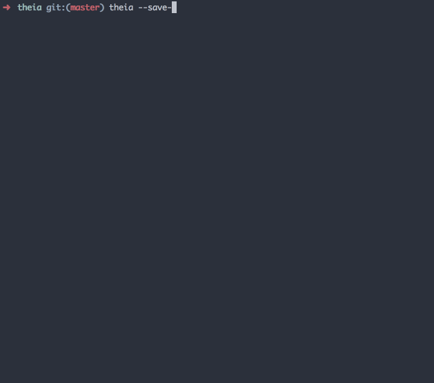

# theia [](https://circleci.com/gh/wzaghal/theia)

##Description
theia looks for any published npm packages that you are requiring and checks to see if you they are available in your package.json file.

Depending on the options provided, theia can then display the packages, ask you to select what packages you want to install or go ahead and install them on your behalf.

## Install
```
npm install theia -g
```
## Usage
```
$ theia

  Found 12 missing packages:

  * underscore
  * grunt
  * body-parser
  * winston
  * cookie-parser
  * gulp-sass
  * gulp-rename
  * gulp-jsbeautifier
  * gulp-eslint
  * gulp-inject
  * gulp-karma
  * gulp-filter

```

## Flags


**--save**: Saves discovered packages as dependencies, and runs npm install.
```
$ theia --save

gulp-sass@1.3.3 node_modules/gulp-sass
├── clone@0.1.19
├── map-stream@0.1.0
├── vinyl-sourcemaps-apply@0.1.4 (source-map@0.1.43)
├── gulp-util@3.0.4 (array-differ@1.0.0, object-assign@2.0.0, beeper@1.0.0, array-uniq@1.0.2, lodash._reevaluate@3.0.0, lodash._reescape@3.0.0, lodash._reinterpolate@3.0.0, replace-ext@0.0.1, minimist@1.1.1, vinyl@0.4.6, lodash.template@3.4.0, through2@0.6.5, dateformat@1.0.11, multipipe@0.1.2)
└── node-sass@2.1.1 (get-stdin@4.0.1, object-assign@2.0.0, replace-ext@0.0.1, nan@1.7.0, chalk@0.5.1, semver@4.3.3, shelljs@0.3.0, mkdirp@0.5.0, cross-spawn@0.2.9, meow@3.1.0, npmconf@2.1.1, gaze@0.5.1, sass-graph@1.3.0, request@2.55.0, pangyp@2.1.0)
....
```

**--save -i**: Promps the user for confirmation, before saving discovered packages as dependencies and running npm install.


**--save-dev**: Saves discovered packages as dev dependencies, and runs npm install.
```
$ theia --save-dev

gulp-sass@1.3.3 node_modules/gulp-sass
├── clone@0.1.19
├── map-stream@0.1.0
├── vinyl-sourcemaps-apply@0.1.4 (source-map@0.1.43)
├── gulp-util@3.0.4 (array-differ@1.0.0, object-assign@2.0.0, beeper@1.0.0, array-uniq@1.0.2, lodash._reevaluate@3.0.0, lodash._reescape@3.0.0, lodash._reinterpolate@3.0.0, replace-ext@0.0.1, minimist@1.1.1, vinyl@0.4.6, lodash.template@3.4.0, through2@0.6.5, dateformat@1.0.11, multipipe@0.1.2)
└── node-sass@2.1.1 (get-stdin@4.0.1, object-assign@2.0.0, replace-ext@0.0.1, nan@1.7.0, chalk@0.5.1, semver@4.3.3, shelljs@0.3.0, mkdirp@0.5.0, cross-spawn@0.2.9, meow@3.1.0, npmconf@2.1.1, gaze@0.5.1, sass-graph@1.3.0, request@2.55.0, pangyp@2.1.0)
....

```

**--save-dev -i**: Promps the user for confirmation, before saving discovered packages as dev dependencies and running npm install.


**--save-dev --save -i**: Promps the user to select packages that should be installed as dev dependencies, and packages that should be installed as dependencies. Runs npm install after the user makes their choices.
